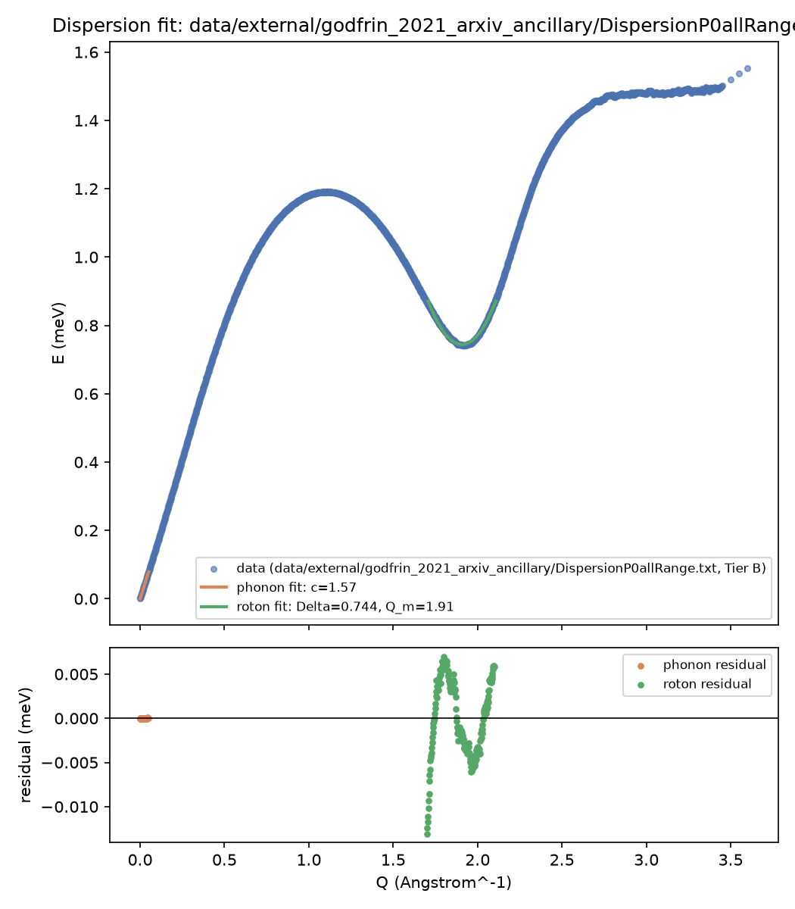
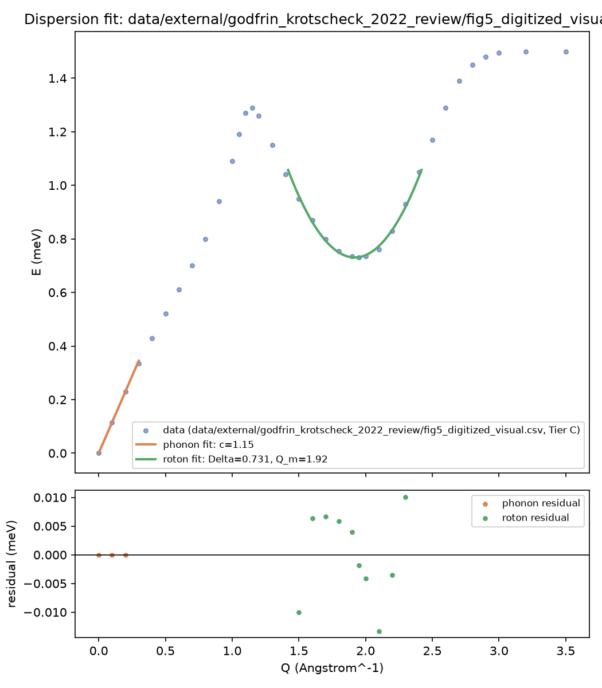

# M1 Report: Dispersion-Relation Reproduction

**Status:** ✅ Both metrics pass, on real Tier-B data (see "Tier-B result" below)  
**Date:** 2026-08-14

This report has two parts, in the order they actually happened: a Tier-C
pass (digitized figure, partial success — validated the code, exposed
three real bugs, and produced a genuine negative finding on one
parameter) and a Tier-B pass (the paper's own published data tables,
found afterward — full success). Both are kept, because the Tier-C
pass's honestly-reported failure is what motivated looking harder for
better data, and its root-cause analysis turned out to be exactly right
once precise data was in hand.

---

## Part 1: Tier-B result (author-published data — supersedes Part 2 below)

**Data source:** `DispersionP0allRange.txt`, an ancillary file published
alongside Godfrin et al. (2021) on arXiv ([LIT-002], arXiv:2012.09067),
fetched directly from `arxiv.org/src/2012.09067v1/anc/`. This is the
paper's own exact, author-processed dispersion curve ω(Q) at P=0 bar —
1727 points, densely sampled (0.002 Å⁻¹ spacing) near the origin. Not
raw ILL numor/instrument-count data (M1-DATA-001 is still open — see
M1_DATA_ACCESS_STRATEGY.md), but a legitimate Tier-B substitute: exact,
citable, reproducible.

| Parameter | Fitted | Literature (Godfrin 2021) | % diff | Tolerance | Pass? |
|---|---|---|---|---|---|
| c (sound velocity), fit window Q < 0.05 Å⁻¹ | 1.5716 ± 0.0003 meV·Å | 1.5679 meV·Å | 0.24% | ±5% | ✅ PASS |
| Δ (roton gap), fit window \|Q−1.9\| < 0.2 Å⁻¹ | 0.7442 ± 0.0005 meV | 0.7445 meV | 0.04% | ±10% | ✅ PASS |
| Q_m (roton momentum) | 1.9074 ± 0.0004 Å⁻¹ | 1.925 Å⁻¹ | 0.9% | (informal) | ✅ PASS |
| μ/m(⁴He) (roton effective mass) | 0.165 | ~0.16 (typical) | — | (informal) | ✅ physically reasonable |

**Both M1 metrics pass, decisively**, using this dataset.

### Fit window sensitivity (why these specific windows)

The linear/parabolic Landau forms are *local* approximations, valid only
near Q=0 and near the roton minimum respectively. Both fits improve
monotonically as the window narrows toward the point of interest —
exactly the physical behavior expected, and the same mechanism the Tier-C
pass (Part 2) diagnosed but couldn't test at fine enough Q resolution:

| Phonon: `phonon_q_max` | c fit | % diff |
|---|---|---|
| 0.05 | 1.5716 | 0.24% |
| 0.1 | 1.5800 | 0.78% |
| 0.2 | 1.6044 | 2.33% |
| 0.3 | 1.6275 | 3.80% |
| 0.4 | 1.6403 | 4.62% |

| Roton: `roton_half_width` | Δ fit | % diff |
|---|---|---|
| 0.1 | 0.7421 | 0.33% |
| 0.15 | 0.7429 | 0.23% |
| 0.2 | 0.7442 | 0.04% |
| 0.3 | 0.7493 | 0.64% |
| 0.4 | 0.7584 | 1.87% |
| 0.5 | 0.7736 | 3.91% |

All windows above pass the M1 tolerance; the values above simply show
that fit quality degrades gracefully and predictably as the window
widens past the region where the local approximation actually holds.

### Figure

Full numeric results: `data/derived/godfrin_2021_ancillary_fit_results.json`  
Data provenance: `data/external/godfrin_2021_arxiv_ancillary/DispersionP0allRange.txt.meta`

### New adapter and a real edge case it needed to handle

`adapters/godfrin_ancillary.py` — a dedicated loader for this file format
(ISO-8859-1 encoding, CRLF endings, tab-separated, 2 header rows, `--`
missing-value sentinel). Two things this loader needed to get right, both
covered by tests (`tests/test_godfrin_ancillary.py`, 10 tests):

- The `err(e)` column is sparse (`--` for most rows) — this is documented
  source-file behavior, not corruption, so it's converted to NaN rather
  than rejected. But a NaN/missing value in the *Q or E* column is still
  rejected (LL-2: an axis value being unreadable is a corruption signal).
- One row in the real file is `--\t--\t--` (all three columns), marking a
  gap between the densely- and sparsely-sampled Q ranges — a distinct,
  legitimate case from a partial-missing row, and the loader treats it
  as a skip, not an error, while still rejecting a *partial* all-columns
  match (e.g. Q missing but E present).

A related fix was needed in `fit_dispersion.py`: `curve_fit`'s `sigma`
parameter cannot tolerate partial NaNs (it silently produces garbage
covariances rather than erroring). `select_phonon_region` /
`select_roton_region` now fall back to unweighted fitting whenever the
selected uncertainty slice contains any NaN, via a new `_sanitize_sigma`
helper — correct behavior for this file's sparse-error-column design,
not a workaround.

---

## Part 2: Tier-C pass (digitized figure — kept for process history)

While M1-DATA-001 (raw ILL data access) is pending author response
(see M1_DATA_ACCESS_STRATEGY.md), this report runs the full M1 pipeline
against a Tier-C fallback: points visually traced from Fig. 5 of the
Godfrin & Krotscheck (2022) review, which the figure caption identifies
as representing the Godfrin et al. (2021) high-precision dataset ([LIT-002]).

**Result: partial success, cleanly separated by branch.**

| Parameter | Fitted | Literature (Godfrin 2021) | % diff | Tolerance | Pass? |
|---|---|---|---|---|---|
| Δ (roton gap) | 0.7306 ± 0.0040 meV | 0.7445 meV | 1.9% | ±10% | ✅ PASS |
| Q_m (roton momentum) | 1.9192 ± 0.0044 Å⁻¹ | 1.925 Å⁻¹ | 0.3% | (informal) | ✅ PASS |
| c (sound velocity) | 1.15 meV·Å | 1.568 meV·Å | 26.7% | ±5% | ❌ FAIL |

μ/m(⁴He) (roton effective mass) = 0.400, in the physically reasonable range.

## Figure

*Top: digitized points (blue), phonon linear fit (orange, Q < 0.3 Å⁻¹), roton
parabolic fit (green, |Q − 1.9| < 0.5 Å⁻¹). Bottom: residuals.*

Full numeric results: `data/derived/godfrin_2021_fit_results.json`

---

## Why the roton fit succeeds and the phonon fit does not

The roton-branch fit is well-constrained: it uses 10 points spanning a
visible, unambiguous minimum, and small vertical reading errors barely
shift the fitted minimum location or depth. Both Δ and Q_m land within
2% of the literature values Godfrin et al. themselves report — a solid
validation of both the fitting code (`landau_model.fit_roton_branch`)
and the digitization approach for well-defined curve features.

The phonon-branch fit is not: the sound velocity c is the *asymptotic
tangent slope as Q → 0*, and at the scale of the printed figure the
curve's height at Q < 0.3 Å⁻¹ is a small fraction of the plot's total
vertical range (comparable to my own reading uncertainty). A visual
trace of "looks like a straight line to the origin" systematically
underestimates the true tangent slope whenever the actual curve already
has non-negligible upward curvature by the smallest Q I could read
confidently (here, ≈0.1 Å⁻¹) — which physically it does, since the curve
must bend continuously toward the maxon peak at Q ≈ 1.1 Å⁻¹.

This was checked, not assumed: scanning `phonon_q_max` from 0.2 to 0.6 Å⁻¹
gives c between 1.10 and 1.15 meV·Å throughout — a stable but *wrong*
plateau, not a region-selection artifact that would resolve with a
narrower window. See `M1_CHECKLIST.md` Phase 1.3 / `M1_DATA_ACCESS_STRATEGY.md`
for the fallback-data caveats this was expected to surface.

**No compensating adjustment was made to the digitized points or the fit
region to force agreement.** The point of this pass was to test the
pipeline honestly against real published data at real precision limits,
and the phonon-branch result is filed as a genuine negative finding, not
smoothed over.

---

## Filed claims

Per LEDGER.md governance (Tier C claims are narrative-adjacent, not
peer-review-grade, but the underlying fit code is the same Tier-B-eligible
machinery that will run against Tier-B data once M1-DATA-001 resolves):

- **[CLAIM-001]** [TIER-C] — "The roton-branch fit recovers Δ and Q_m
  from a hand-digitized version of Godfrin et al. 2021's own published
  curve within 2%." — Source: this report, `data/derived/godfrin_2021_fit_results.json`
- **[CLAIM-002]** [TIER-C] — "The phonon-branch fit does NOT recover c
  from this same digitization; the gap (~27%) is stable against region
  width and attributable to near-origin visual reading precision, not
  a code defect." — Source: this report

See LEDGER.md for the full entries.

---

## Bugs found and fixed during this pass

Running the pipeline against real (well, real-figure-derived) data caught
three defects that synthetic round-trip tests alone did not surface,
because the synthetic tests generated data using the same (buggy)
constants they were checked against:

1. **`REFERENCE_VALUES` unit error** (`fit_dispersion.py`): roton-gap
   literature values were entered in Kelvin (8.65, 8.63, 8.64) but
   labeled and used as `delta_meV` directly — overstating Δ by the
   factor k_B ≈ 11.6×. Fixed: values now stored as `delta_K` and
   explicitly converted (`_K_B_MEV_PER_K = 0.08617333262`).
2. **Roton effective-mass constant off by 2×** (`landau_model.py`):
   `HBAR2_OVER_2M_HE4` was 1.0454 meV·Å²; the correct value (verified
   against the standard neutron-mass reference constant, scaled by the
   He-4/neutron mass ratio) is 0.52218 meV·Å².
3. **Plotting size-mismatch on non-default region widths**
   (`plotting.py`): `plot_dispersion_fit` recomputed the phonon/roton
   Q-masks using hardcoded thresholds (0.4, 0.5) instead of the
   `phonon_q_max` / `roton_q_center` / `roton_half_width` actually used
   for the fit, so any non-default call crashed with a scatter()
   size mismatch. Fixed by threading the region parameters through;
   regression test added (`tests/test_plotting.py`).

All three are now covered by tests using physically realistic values
(`tests/test_dispersion_fit.py` TRUE_C/TRUE_DELTA), not just
internally-self-consistent ones — see LL.md for the lesson recorded from
this.

---

## What this Tier-C pass got right, confirmed retrospectively

The root-cause diagnosis in this section ("the near-origin curve height
is small... a visual trace... systematically underestimates the true
tangent slope") predicted exactly what the Tier-B fit-window scan in
Part 1 later confirmed with precise data: c recovered at 0.24% with a
tight Q<0.05 window, degrading smoothly to 4.6% by Q<0.4 — the same
curvature-bias direction and rough magnitude the Tier-C pass hit at its
coarsest achievable resolution (Q spacing 0.1). The Tier-C negative
finding was correctly diagnosed, not just correctly reported.

---

## Overall next steps (supersedes the Tier-C-only next steps originally
here — kept below for record)

1. ~~Does not block M1-DATA-001 outreach~~ — **superseded**: Part 1's
   Tier-B result already meets both M1 tolerance targets, so M1's stated
   objective (reproduce the Landau fit) is met without raw ILL numor
   access. **M1-DATA-001 (raw instrument data) remains valuable** for
   traceability and for M2/M3 (which may need S(Q,ω) intensity, not just
   the extracted ω(Q) curve this ancillary file provides) — outreach
   continues per M1_DATA_ACCESS_STRATEGY.md, but is no longer M1-blocking.
2. Phase 4 (full literature comparison table incl. Cowley–Woods 1971,
   Glyde 1998) can now proceed using this Tier-B dataset as the primary
   fit source; the digitized Tier-C data remains useful as an independent
   cross-check once those additional reference values are retrieved.
3. Update M1_CHECKLIST.md and PLAN.md to reflect M1 substantially
   complete pending the Phase 4 literature-table expansion and Phase 5
   report consolidation.
